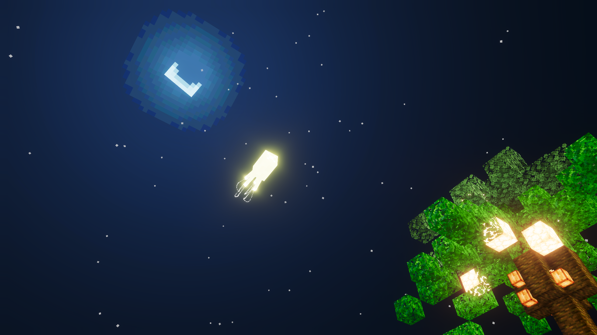

> **Recommended Settings:**
>  Maximum render distance: 8 chunks. Please load the mod on a new map for the best experience.
>
> **Note:** The first terrain generation may take **1 to 2 minutes**. Please be patient.
>
> **Dev / Art / Design:** Fairydewstz
> 
> **Mod Community QQ Group:** 767870624

------

### **In this world, you can still follow the vanilla survival goals, but we've brought you a heavenly survival experience:**

When you first enter the world, you will spawn on a platform made of **clouds and obsidian**.

## **New Items**

**"Cloud"** and **"Wind"** are essential materials for exploring this world. You can mine some clouds from the spawn platform.

- **Clouds** can be held to attract **Cloudskaters**, or thrown on the ground to tempt **Windlin** to breed them and reward you with **Wind**. You can also feed clouds directly to Windlin by interact with them while holding a cloud. In return, the Windlin will give you a bundle of **Wind**.
- Holding **Wind** and interact will launch a **high-pressure air burst**, which can **blow away mobs (including players)** and disperse strong cyclones to prevent being swept away, and it can also be used to extinguish fire.

## **New Mobs**

- **Cloud Moth** – A variant of the silverfish that can fly, harass players, and will actively dive into fire or lava.
- **Cloudskater** – Can be ridden directly. Hold a cloud to control its direction, allowing you to travel across distant islands.
- **Windlin** – Blows monsters off islands and can exchange **clouds for wind**. Winds can be used by long-pressing or right-clicking, but be careful: holding wind will make the Windlin think you want to play, and it might blow you away!
- **Cloudjelly** – Resembles a jellyfish and drifts near cloud layers, glowing at night. Be cautious though, touching it will sting and poison you.

## **New Weather**

This world introduces unique weather phenomena: **Cyclones** and **Anticyclones**.
Each strong cyclone event lasts **1–2 minutes**. Staying in water can prevent you from being blown away.

- **Cyclones** spawn with thunderstorms and will continuously lift all nearby entities into the air.
- **Anticyclones** usually bring clear skies, but beware—you and your pets could be blown off the islands.

**Tip:** Fire wind at the cyclone's center on the ground to disperse the storm and restore clear weather.

## **New Structures**

The world may randomly generate **cottages** and **hidden treehouses** as resource shelters where you can rest and restock.

In the skies, you'll find floating **Celestia Fortresses**:

- **First floor:** Loot chests
- **Second floor:** End portal frame at the center and Cloud Moth spawners—watch out for the swarm!

## **Ore Distribution**

**Diamond, Gold, and Redstone ores** only generate in the **deepslate layer** inside islands.

Other ores generate evenly throughout the **stone** and **deepslate layers** within the islands.

## **Gallery**

> Cloud Moth and Cliff

> New Mob – Cloudskater

> New Mob – Windlin

> New Mob – Cloudjelly

> Celestia Landscape

> A Cottage Nestled above the Cloud Layers

> Desert and Oasis

> Natural Haven
